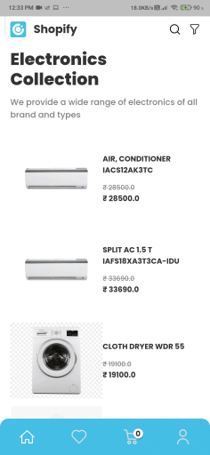
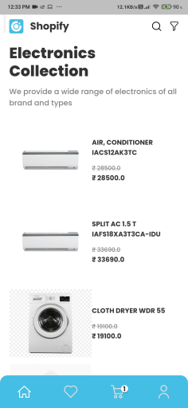
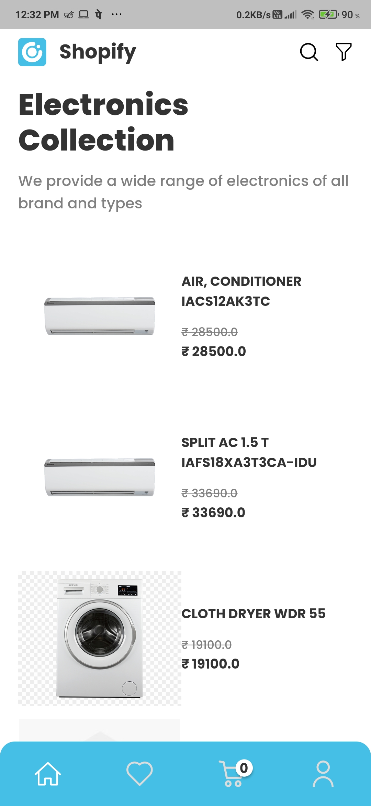
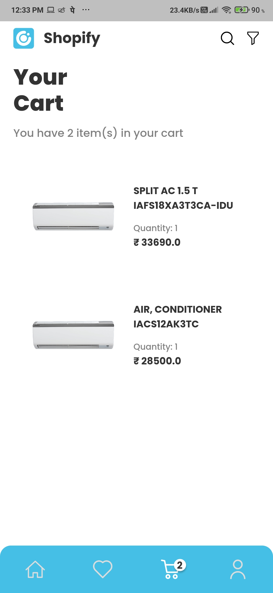

<div align="center"> 
    
    <h2 align="center"><b>Shopify</b></h2>
    <h3 align="center">
        A Electronics Shopping Application
    </h3>
</div>

<div align="center">
    <br><br>
    <h3 align="center">made</h3>
    
    <h3 align="center">
        <i>
        Implemented with Dart's Sound Null-Safety for stable, performant and efficient application
        </i>
    </h3>
    <br><br>
</div>

---

<div><br></div>

## Table of Contents
1.  About
1.  Built With
1.  Screenshots
1.  How can you use it ?
    - Prerequisites
    - Usage
1. Contact


# About
#### It's an application that shows off an e-commerce application for selling electronics, along with some novel ways to add/remove goods from the basket or favourites section. It also makes use of a'sqflite' database for storing objects locally and displaying them even when the device is turned off.

<div><br><br></div>

# Built With
#### This application is built using Flutter, SQL and Dart which is an underlying language which Flutter requires.

<div align="center" display="block">
<br>


</div>

<br><br></div>

# Screenshots
#### First this app was designed using Figma and then implemented using Flutter and Firebase

### Design File - [Shopify Design](https://www.figma.com/file/TOJ1YfO66ijV2T0SmIaUCj/Shopify?node-id=0%3A1)

### Here are the App Screenshots
- Home Screen Animation
<br><br>


- Sliding Cards Animation
<br><br>


- Home Screen
<br><br>


- Cart Screen
<br><br>

<br><br>

# How can you use it ?
#### You need to follow this simple steps to execute this application locally on your machine

## Prerequisites
1. Flutter SDK must be installed -> [How to do it ?](https://flutter.dev/docs/get-started/install)
1. Basic knowledge of Flutter & Android


## Usage
1. Clone the project by command
    ```
        git clone https://github.com/mayurnile/shopify
    ```
1.  Execute the app!

## Note
### Currently the two packages used 'swipe_gesture_recognizer' and 'data_connection_checker' does not support Dart's null-safety, so even though the code supports Null-Safety the project won't execute. I am working towards replacing those pakcages and create my own implementation for that. Till then use this command to execute the project
```
        flutter run --no-sound-null-safety
```
<div><br><br></div>

# Contact
Mayur Nile - [Linkedin](https://www.linkedin.com/in/mayurnile/) - mayurnile95@gmail.com

Project Link: [https://github.com/mayurnile/shopify](https://github.com/mayurnile/shopify)